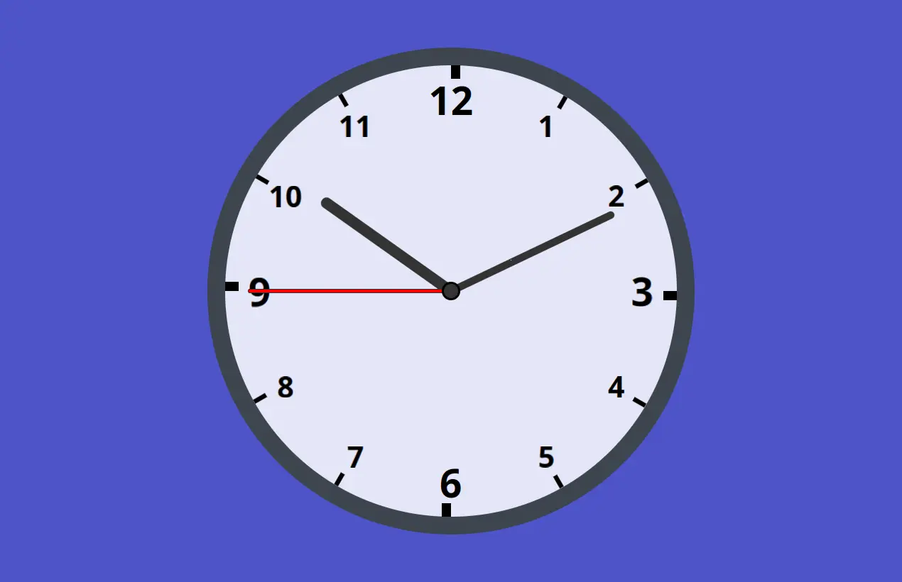

# Analog Clock

A simple clock built using vanilla HTML, CSS, and JavaScript. This project demonstrates the use of CSS transformations to create a clock face with dynamic numbers, rotating hands, and markers for each second.

## Demo

You can view a live demo of this project [here](https://wayfarerdesert.github.io/analogClock/)

Here's an example of how the clock looks:



## Installation

1. Clone this repository:

   ```bash
    git clone https://github.com/Wayfarerdesert/analogClock.git
   ```

2. Navigate to the project directory:

   `cd analogClock`

3. Open the index.html file in your browser.

## Technologies Used

- HTML
- CSS
- JavaScript (Vanilla)
